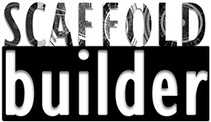

#### Scaffold_builder: Combining de novo and reference-guided assembly with Scaffold_builder
* [Installation](#installation)
    * [dependencies](#dependencies)
    * [bioconda](#bioconda)
    * [webserver](#webserver)
    * [git](#git)
* [Usage](#usage)
* [Citing](#citing)

## Installation
### Dependencies
- [Python 2.7](http://www.python.org/download)
- [MUMMER (nucmer)](http://mummer.sourceforge.net/)

### Bioconda
You can now easily install FOCUS using [conda](https://conda.io) via the
[Bioconda](https://bioconda.github.io/) channel. It is as easy as:

    # bioconda should handle all the dependencies
    conda create -n scaffold_builder -c bioconda scaffold_builder
	source activate scaffold_builder

### Webserver
    http://edwards.sdsu.edu/scaffold_builder/

### Git
    # clone focus
	git clone git@github.com:metageni/Scaffold_builder.git
	# run scaffold_builder.py
	python2.7 scaffold_builder.py -q [QUERY] -r [REFERENCE]

## Usage

    scaffold_builder.py -q query_contigs.fna -r reference_genome.fna -p output_prefix [-t] [-i] [-a] [-b]

	-q fasta file of contigs
		Required. Query contigs in Fasta format. These contigs may be the output of a de novo
		assembly program such as Newbler, Velvet or MIRA.

	-r fasta file containing reference genome
		Required. Reference genome in Fasta format. This should preferably be a completed genome
		sequence.

	-p prefix output files
		Required. All the output files have this project name as prefix.

	-t length of terminus that will be aligned (default 300 nt)
		At any break between two contigs, scaffold_builder checks whether the termini
		of the adjacent contigs are homologous by aligning them using Smith-Waterman's Algorithm, and
		combines them if that is the case.

	-i minimum identity for merging contigs (default 80%)
		If the termini are similar, scaffold_builder assumes that the contigs should
		have been combined by the assembly program, but the similarity was probably
		below the assembly thresholds, or the contigs were not merged due to ambiguous
		read mapping. The sequences are combined and in the case that non-identical
		nucleotides are aligned, the IUPAC code of their consensus is placed in the
		resulting sequence.

	-a minimum length for ambiguously mapped contigs (default 95%)
		If a contig maps to more than one location on the reference genome, it will
		not be scaffolded because it's location is ambiguous. This parameter defines
		how much of the length of a contig should be mapped in more than one location
		for it to be considered ambiguously mapped.

	-b 0/1 dictates behavior for rearrangements (default 0)
		0: place end-to-end
		1: create new scaffold sequence
		If the mapping of the contigs onto the reference suggests that they overlap,
		but the contig termini are too dissimilar to join them, this option dictates
		whether scaffold_builder places the contigs end-to-end (default; deletions
		expected) or to start a new scaffold sequence (inversions expected).

	-g maximum gap length allowed (default 5000nt)

## Citing
Scaffold_Builder was written by Genivaldo G. Z. Silva. Feel free to [contact me](mailto:genivaldo.gueiros@gmail.com)

If you use Scaffold_Builder, please cite it:

	Silva GG, Dutilh BE, Matthews TD, Elkins K, Schmieder R, Dinsdale EA, Edwards RA.
	Combining de novo and reference-guided assembly with Scaffold_builder,
	Source Code for Biology and Medicine 2013.